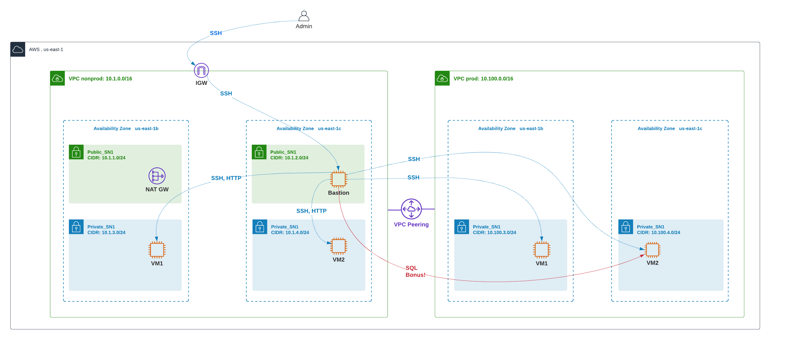

# Multi-Environment Infrastructure with Terraform

**Student:** YOUR_NAME  
**Course:** ACS730: Cloud Automation and Control Systems  
**Term:** Winter 2026  
**Type:** Assignment 1
**Instructor:** Leo Lu 

---

## Overview

This project uses Terraform to deploy a multi-environment AWS infrastructure consisting of two VPCs (nonprod and prod) connected via VPC peering. The infrastructure includes EC2 instances, a bastion host, NAT gateway, Apache web servers, and a MySQL client.

---

## Architecture

- **VPC nonprod** (`10.1.0.0/16`) — 2 public subnets, 2 private subnets, IGW, NAT GW, bastion host, VM1 and VM2 with Apache
- **VPC prod** (`10.100.0.0/16`) — 2 private subnets only, VM1 and VM2 (no packages installed)
- Both VPCs are connected via **VPC Peering**
- Region: `us-east-1` (AZs: `us-east-1b`, `us-east-1c`)

## Architecture Diagram


---

## Folder Structure

```
modules/
  network/        # reusable network module (VPC, subnets, IGW, NAT GW, route tables)
  compute/        # reusable compute module (EC2, security groups, bastion)
  peering/        # reusable peering module (VPC peering connection, routes)

environments/
  nonprod/
    network/      # nonprod VPC deployment
    compute/      # nonprod EC2 deployment
  prod/
    network/      # prod VPC deployment
    compute/      # prod EC2 deployment
  global/
    peering/      # VPC peering between nonprod and prod
```

---

## Prerequisites

Before deploying, the following must be created manually:

### 1. S3 Bucket for Terraform Remote State

Create an S3 bucket to store Terraform state files. This must be done **before** running any Terraform commands.

- **Bucket name:** `YOUR_BUCKET_NAME` (replace with your actual bucket name)
- **Region:** `us-east-1`
- **Versioning:** Enabled
- **Public access:** Blocked

Steps in AWS Console:
1. Go to S3 → Create bucket
2. Set bucket name and region
3. Enable versioning under the "Properties" tab
4. Keep "Block all public access" turned on

### 2. SSH Key Pair

Create an SSH key pair in AWS — this is used to connect to all EC2 instances.

1. Go to AWS Console → EC2 → Key Pairs → Create key pair
2. Name it `acs730-keypair`
3. Download the `.pem` file and store it safely on your local machine
4. Set correct permissions:
```bash
chmod 400 acs730-keypair.pem
```

### 3. AWS CLI Configured

Make sure your AWS credentials are configured:
```bash
aws configure
```

### 4. Terraform Installed

Terraform version `>= 1.0.0` is required. Verify with:
```bash
terraform version
```

---

## Deployment Steps

Deploy in this exact order — each step depends on the previous one.

### Step 1 — Deploy nonprod network

```bash
cd environments/nonprod/network
terraform init
terraform plan
terraform apply
```

Creates: nonprod VPC, 2 public subnets, 2 private subnets, IGW, NAT GW, route tables.

### Step 2 — Deploy nonprod compute

```bash
cd environments/nonprod/compute
terraform init
terraform plan
terraform apply
```

Creates: bastion host (public subnet), VM1 and VM2 (private subnets) with Apache installed.

### Step 3 — Deploy prod network

```bash
cd environments/prod/network
terraform init
terraform plan
terraform apply
```

Creates: prod VPC, 2 private subnets only, route tables (no IGW, no NAT GW).

### Step 4 — Deploy prod compute

```bash
cd environments/prod/compute
terraform init
terraform plan
terraform apply
```

Creates: VM1 and VM2 in private subnets (no extra packages installed).

### Step 5 — Deploy VPC peering

```bash
cd environments/global/peering
terraform init
terraform plan
terraform apply
```

Creates: VPC peering connection between nonprod and prod, and adds peering routes to all route tables.

---

## Verifying Connectivity

### Get IP addresses

```bash
# bastion public IP and nonprod VM private IPs
cd environments/nonprod/compute
terraform output

# prod VM private IPs
cd environments/prod/compute
terraform output vm_private_ips
```

### SSH to bastion

```bash
# start SSH agent on your local machine
eval $(ssh-agent -s)
ssh-add acs730-keypair.pem

# connect to bastion with agent forwarding
ssh -A -i acs730-keypair.pem ec2-user@<bastion_public_ip>
```

### SSH from bastion to nonprod VMs

```bash
# from inside bastion
ssh ec2-user@<nonprod_vm1_private_ip>   # 10.1.3.x
ssh ec2-user@<nonprod_vm2_private_ip>   # 10.1.4.x
```

### Test Apache on nonprod VMs

```bash
# from inside bastion
curl http://<nonprod_vm1_private_ip>
curl http://<nonprod_vm2_private_ip>
```

Expected output:
```
Name: OWNER_NAME
Environment: nonprod
Private IP: 10.1.3.x
```

### SSH from bastion to prod VMs

```bash
# from inside bastion
ssh ec2-user@<prod_vm1_private_ip>   # 10.100.3.x
ssh ec2-user@<prod_vm2_private_ip>   # 10.100.4.x
```

### Bonus — test MySQL client connectivity to prod VM2

```bash
# from inside bastion, verify MySQL client is installed
mysql --version

# test network connectivity to prod VM2 on port 3306
curl -v telnet://<prod_vm2_private_ip>:3306
```

Expected output:
```
* Connected to 10.100.4.x port 3306
```
"Connection refused" is the expected response — it confirms network connectivity exists on port 3306 through the VPC peering connection. No MySQL server is installed on prod VM2.

---

## Cleanup

**Important:** NAT Gateway costs approximately $140/month. Always destroy all resources after you are done.

Destroy in **reverse order**:

```bash
# 1. destroy peering
cd environments/global/peering
terraform destroy

# 2. destroy prod compute
cd environments/prod/compute
terraform destroy

# 3. destroy prod network
cd environments/prod/network
terraform destroy

# 4. destroy nonprod compute
cd environments/nonprod/compute
terraform destroy

# 5. destroy nonprod network
cd environments/nonprod/network
terraform destroy
```

Verify in AWS Console that all resources have been removed — especially the NAT Gateway and EC2 instances.

---

## Notes

- All Terraform state is stored remotely in S3 under `YOUR_BUCKET_NAME`
- State is segregated per environment and component (e.g. `nonprod/network/terraform.tfstate`)
- The `.terraform/` directory and `acs730-keypair.pem` are excluded from submission
- VPC peering was implemented with Terraform using a dedicated peering module